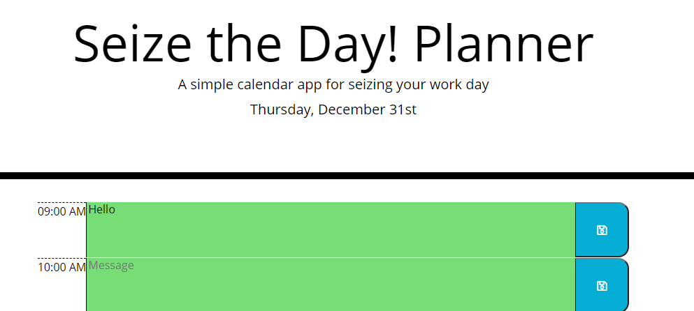
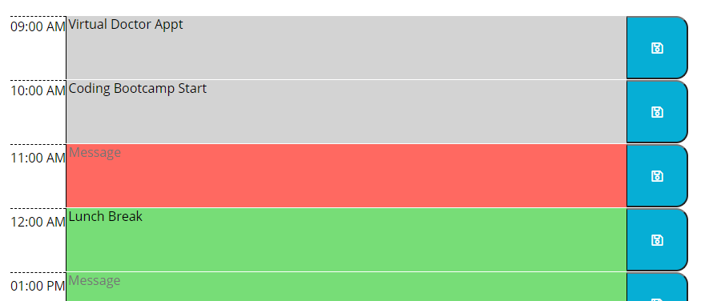
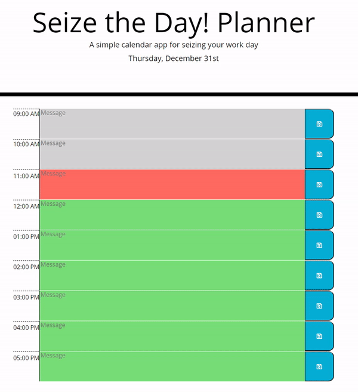

# Seize the Day! Planner

Carpe diem

-----------------------
## Table of Contents
1. [Description](#description)
2. [Deployed Link](#deployed-link)
3. [Walkthrough](#walkthrough)
4. [Code Snippet](#code-snippet)
5. [Prerequisites](#prerequisites)
6. [Installation Instructions](#installation-instructions)
7. [Built with](#built-with)
8. [Licenses](#licenses)
9. [Author](#author)
10. [Acknowledgements](#acknowledgements)

-----------------------
## Description

Do you feel like you get nothing done in the day? Do you feel like the hours just slip away? Not anymore. With th Seize the Day Planner, you can take control of your life!.

Seize the Day Planner is a simple calendar application that allows you to save important events for each hour of the day. Expect to see an increase in productivity of 110%!

-----------------------
## Deployed Link
https://akhalid88.github.io/seize-the-day-planner/ 

-----------------------
## Walkthrough
Upon loading the webpage, the user is greeted with the following header


The user can click in any of the pre-created text boxes and input the schedule/events that they would like to remember. Whne the have entered what they want to track, they can click on the blue save button to save the data to local storage.

The planner is broken into nine 1-hour blocks starting from 9am to 5pm, the standard work day in the US. 



Here you can see the timeblocks updating as time passes., (Sped up for your viewing convenience)


-----------------------
## Code Snippet

In the loadEvents function I was initally parsing the localStorage for validation before loading the saved text into their respective elements. If there was no data in localStorage, jQuery would throw and error message. I was able to fix this by using the updated comparison below.  

NEW CODE::
```
if (localStorage.length === 0){...}
```

OLD CODE::
```
if (JSON.parse(localStorage.getItem("events")) === "undefined") {...}    
```

This planner uses Moment.js to render the current day and for comparing the time with the timeblocks to determine highlighting. Moment.js called

The following provides the date in the format of "Thursday, December 31st"
```
var date = moment().format("dddd, MMMM Do");
```

For comparing the time each timeblock uses data-time attribute with its respective hour in 24-hour time. I then do a comparison with Moment.js by pulling just the current hour in 24-hour time by using the following code
```
var time = moment().format("HH");
```


-----------------------
## Prerequisites
A computer with an active internet connection and a web browser

-----------------------
## Installation instructions
None

-----------------------
## Built with

- Moment.js
- jQuery
- Javascript
- Bootstrap
- HTML
- CSS
- Git
- Github

-----------------------
## Licenses
This Project is licensed under MIT license

-----------------------
## Author

[LinkedIn](https://www.linkedin.com/in/abdullahkhalid/)
<br>
[GitHub](https://github.com/akhalid88)

-----------------------
## Acknowledgements
- Jerome Chenette (Instructor)
- Manuel Nunes (TA)
- Mahisha Manikandan (TA)
- UC Berkeley Coding Bootcamp